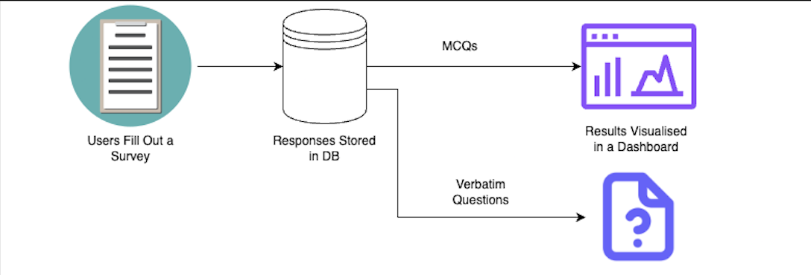
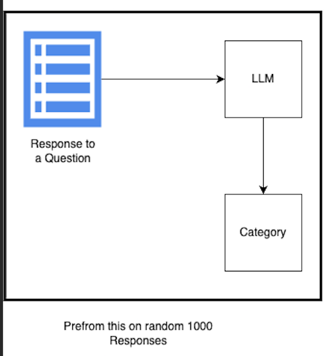
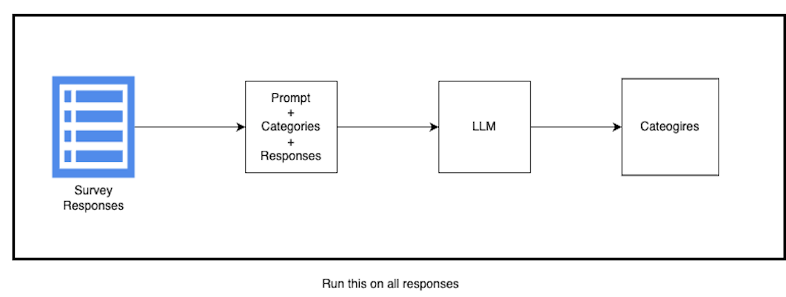

# Transforming Verbatim Survey Responses into Categorical Insights Using LLMs  

This project demonstrates a censored version of a solution I implemented at my workplace, focusing on the use of large language models (LLMs) to categorize and analyze free-text (verbatim) survey responses. The original code, data, and business specifics are not included to protect confidentiality, but the methodology is detailed generically to share the underlying approach.  

## Project Overview  

Analyzing free-text survey responses can be challenging due to their unstructured nature. However, these responses often hold valuable insights that are missed in traditional analytics dashboards designed for categorical or MCQ data.  

This project outlines a **two-step pipeline** that leverages LLMs to systematically assign categories to text responses and refine them for accurate analysis.  

---

## Problem Statement  



In large-scale surveys, free-text responses provide rich, nuanced feedback but are notoriously difficult to analyze at scale. These responses often contain critical insights that go beyond numerical or multiple-choice questions, such as:

- "Why did you give the above rating?"
- "What was your overall experience?"
However, most survey analysis tools focus on structured data, leaving free-text feedback unexplored or underutilized. As a result, stakeholders—whether they are decision-makers, analysts, or product owners—miss out on:

- Actionable insights: Specific pain points or recurring themes from customers.
- Sentiment trends: Understanding why customers feel positively or negatively about their experience.
- Deeper context: The "why" behind customer behaviors or scores in structured survey responses.

Existing solutions like sentiment analysis provide some value but often fail to contextualize the sentiment in a meaningful way. A simple "positive" or "negative" sentiment doesn’t highlight specific issues, such as "slow service times" or "great product quality." This leads to lost opportunities for improving customer satisfaction, identifying areas of improvement, and making data-driven decisions.


## Our Solution
To unlock the value of free-text survey responses, we devised a two-step process that converts each response into a Category and a Sentiment for structured analysis.


1. Step 1: Generating Categories

    - We start by allowing the LLM to assign categories freely, based on the context and meaning of the responses. This is done on a small subset of the data to identify a broad range of potential categories.
    - From these initial results, we refine and consolidate the categories into a unique, standardized list, ensuring that similar or redundant categories are merged for consistency.

2. Step 2: Assigning Categories Consistently

    - With the refined list of categories, we process the remaining responses, instructing the LLM to assign a category only from this predefined list.
    - This ensures consistency across all responses, making the data easier to analyze while maintaining the contextual accuracy of each assignment.

By structuring free-text responses into categories and sentiments, we unlock significant value for stakeholders:

- Customer Insights: Stakeholders can identify recurring themes such as "poor customer service" or "fast delivery times," along with their associated sentiments.
- Data-Driven Decisions: The structured data enables advanced analysis, such as identifying patterns among dissatisfied customers, or tracking trends over time.
- Enhanced Dashboards: Free-text insights can now be integrated into traditional survey dashboards, providing a holistic view of customer feedback.
- Scalability: This approach allows for the consistent processing of large datasets (e.g., 10,000+ responses), enabling organizations to analyze feedback at scale.

This solution turns what was previously a manual and labor-intensive task into a scalable, automated pipeline, empowering businesses to derive actionable insights that drive customer satisfaction and business success.


## Two-Step Solution  

This pipeline uses an a 2 step solution, first step is to create a comprehesive set of categories 
### **Step 1: Generate and Refine Categories**  
The first step is to generate a comprehensive list of categories that capture the meaning of the responses.  



#### Process:  
1. **Initial Categorization**:  
   - Extract a random sample of **1,000 free-text responses**.  
   - Provide the LLM with the following context in the prompt:  
     - The survey question.  
     - The free-text response.  
     - Relevant survey and business context.  
   - The LLM assigns a category to each response that captures its essence.  
   - Categories can follow a **two-part structure**:  
     - **Sentiment** (e.g., "Good," "Bad," "Neutral").  
     - **Specific Category** (e.g., "Customer Service," "Pricing," "Product Quality").  

2. **Refine Categories**:  
   - After processing the 1,000 responses, the LLM may generate redundant or overlapping categories.  
   - Use the LLM to standardize and merge similar categories (e.g., "Good Customer Service" and "Excellent Service" → "Good Customer Service").  
   - Incorporate **manual intervention** to ensure clarity and correctness.  

3. **Validate Categories**:  
   - Perform a **human-in-the-loop review** to compare the assigned category with the original response.  
   - Identify **bad assignments** and flag them.  
   - Incorporate examples of both bad and good assignments into the LLM prompt to improve its performance.  

4. **Final Comprehensive Category List**:  
   - After refinement and validation, a clean, comprehensive list of categories is prepared.  
   - This list is assumed to sufficiently represent the remaining responses in the dataset.  

---

### **Step 2: Assign Categories to Full Dataset**  
Using the refined list of categories, the LLM assigns categories to the remaining **9,000 free-text responses**.  




#### Process:  
1. **Create a Prompt**:  
   - Combine the finalized category list, survey question, and business context in the LLM prompt.  
   - Provide multiple example responses (both good and bad assignments) to guide the LLM.  

2. **Process Responses**:  
   - Batch process the remaining responses through the LLM.  

3. **Output**:  
   - Each response is assigned a structured category, enabling deeper analysis.  

---

## Key Insights and Applications  

Once all responses are categorized, the structured data can be analyzed alongside MCQ responses to uncover patterns. Example analyses include:  
- Identifying top positive and negative feedback trends.  
- Comparing sentiment trends between customer segments (e.g., repeat vs. one-time customers).  
- Discovering actionable insights hidden in verbatim feedback.  

---

## Results and Impact
In our case, the structured categorization of free-text responses unlocked opportunities for detailed analysis that were previously unattainable. By combining the categorized data with other customer metrics such as customer stage, order value, and key pain points, we gained actionable insights that went far beyond basic sentiment analysis.

Key outcomes included:

- Identifying areas in our processes that required immediate improvement—some of which were previously overlooked.
- Pinpointing key drivers of dissatisfaction, enabling us to address recurring customer pain points proactively.
- Focusing energy and resources on aspects of the customer experience that received positive feedback, reinforcing what worked well.

The insights generated through this process received very positive feedback from stakeholders, as they provided a deeper understanding of customer behavior and sentiments. More importantly, the analysis allowed us to implement meaningful changes, resulting in an improved customer experience and more targeted business strategies.

This project proved to be immensely valuable, shedding light on aspects of our business that we previously didn’t realize needed attention while amplifying the strengths that our customers appreciated.

## Challenges and Learnings  

Implementing a system like this comes with its own set of challenges, and there are important considerations and safeguards to ensure reliable results:  

- **LLMs Are Not Deterministic**:  
  Even when asking the LLM to choose a category from a predefined list, it may assign categories outside the list or produce variations in spelling. To address this, I created a **rule-based system** to refine and standardize the responses after processing.  

- **Human-in-the-Loop is Crucial**:  
  This process cannot be left entirely automated. LLMs can assign incorrect categories depending on the context of the question and response. Having humans review and validate the output ensures greater accuracy and avoids critical errors.  

- **Cost Efficiency**:  
  Calling the LLM for each response individually can quickly become **cost-prohibitive**. With the advent of models capable of handling large context windows, it’s possible to batch multiple responses in a single prompt. However, this introduces new challenges.  

- **Batching Responses Isn’t Foolproof**:  
  Asking the LLM to categorize multiple responses in a single prompt (e.g., 20 at a time) might seem efficient, but LLMs can often return incomplete or malformed outputs, such as missing categories or failing to process all the responses provided.  

- **Structured Output**:  
  To mitigate errors, I designed prompts to return structured JSON output, like:  
  ```json
  [
    {"category_1": "string"},
    {"category_2": "string"},
    ...
  ]

Additionally, I included a parameter to control the number of responses in each batch, balancing prompt size and response reliability. While theoretically, it’s possible to fit 100 responses in one prompt, in practice, LLMs often return malformed JSON or omit some responses.

- **Retry Mechanism**:
I implemented a robust retry system. After parsing the JSON response from the LLM, if the output had errors (e.g., incorrect structure or missing categories), I would convert the interaction into a conversational exchange. The LLM was informed of the issue (e.g., "You returned the wrong number of categories" or "Your JSON contains this error") and asked to retry. Most issues were resolved within 3 retries. Any remaining problematic batches were split into smaller chunks for further processing.

- **Data Cleaning Rules**:
Once all responses were categorized, a data cleaning stage was implemented to combine and consolidate similar categories. For example:

Out of 100 responses tagged as "customer service," the breakdown might look like:

- Excellent: 10
- Great: 2
- Good: 40
- Poor: 10
- Bad: 3
- Adequate: 24

To simplify analysis, I merged categories into three broader groups:

- Excellent and Great → Positive Customer Service
- Good and Adequate → Neutral Customer Service
- Poor and Bad → Negative Customer Service

Human involvement was critical in building and validating these category merge rules, which provided clean and actionable data for downstream analysis.

By addressing these challenges, the system became more robust, reliable, and scalable. These solutions also ensured that the final data was of high quality, enabling impactful insights during the analysis phase.